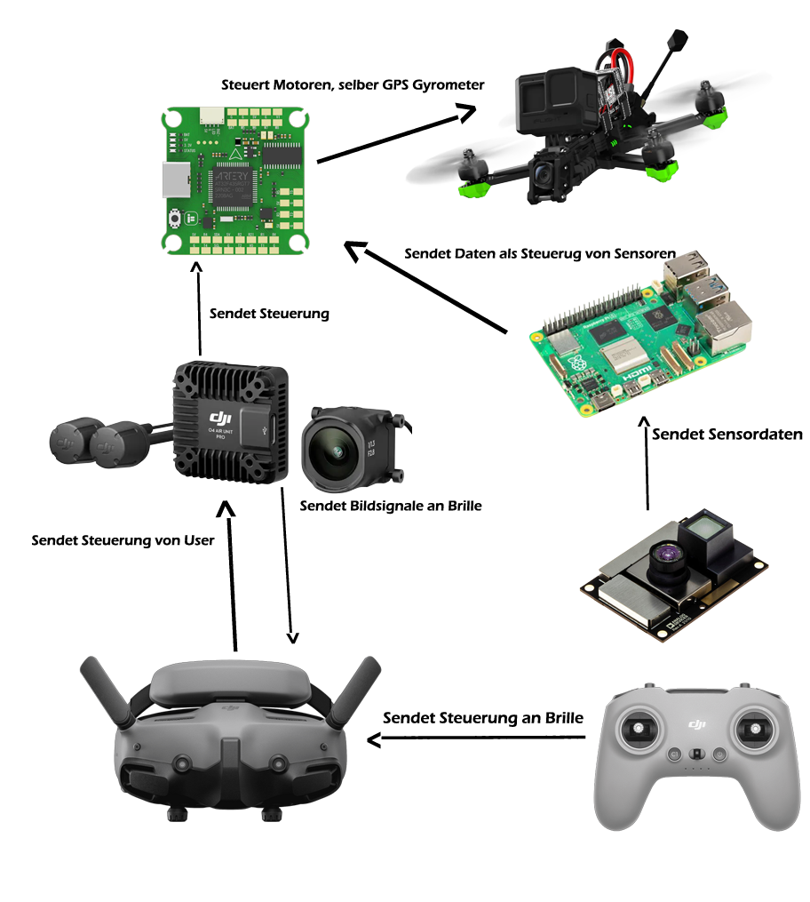

# **Projekttitel**

**Autonome FPV-Drohne mit Companion-Computer und Sensorintegration**

## **Projektbeschreibung**

Ziel des Projekts ist die Entwicklung und Umsetzung einer **teilautonomen FPV-Drohne**, die sowohl manuell mit DJI Goggles 3 und DJI Remote Controller 3 gesteuert werden kann, als auch durch einen **Raspberry Pi** Teilautonome Flugfunktionen ausführt.

Die Basis bildet ein **BNF-FPV-Drohnenmodell (z. B. iFlight Nazgul ECO)** mit integriertem **DJI O4 Air Pro Unit** für digitale Videoübertragung. Die Flugstabilisierung erfolgt über den vorhandenen **Flight Controller (BLITZ ATF435, Betaflight)**. Der Raspberry Pi wird als Erweiterung eingesetzt, um zusätzliche Algorithmen und Sensoren zu verarbeiten.

Geplante Features:

* **Crash-Safer:** Notfallprozeduren zur Stabilisierung bei Kontrollverlust. 

* **Position Hold**: Beim loslassen des Steuer Controllers bleibt Drohne neutral an der Position.

* **Turtle Mode:** automatisches Aufrichten der Drohne nach Crash.

* **Autopilot:** automatische Flugsteuerung basierend auf Sensordaten (GPS, LiDAR, Ultraschall, Kamera mit YOLO).

* **Auto-Hover und Auto-Brake:** Stabilisieren der Drohne an Ort und Stelle bzw. kontrolliertes Abbremsen.

* **Webinterface:** Eingabe von Parametern (z. B. Gewicht, Schub, Flugstil) sowie Darstellung von Telemetrie und Flugpfaden.

* **Crash-Map:** Speicherung und Visualisierung von Unfällen im Webinterface.

* **Flight Logging & Strichliste:** automatische Auswertung der Flüge.

---

## **Projektziele**

* Aufbau und Inbetriebnahme einer FPV-Drohne mit DJI O4 Air  Pro Unit.

* Integration eines Raspberry Pi als Companion-Computer.

* Entwicklung von Algorithmen für **Autopilot, Auto-Hover und Auto-Brake**.

* Implementierung eines **Webinterfaces** zur Steuerung und Visualisierung.

* Durchführung von Simulationen (Liftoff, Gazebo, Betaflight SITL) zur Minimierung von Hardware-Risiken.

* Praxistests

---

## **Projektumfang / Abgrenzung**

**Umfang:**

* Hardware: FPV-Drohne, Flight Controller, O4 Air Pro Unit, Raspberry Pi, Sensoren (GPS, Ultraschall/LiDAR, Kamera).

* Software: Betaflight/ArduPilot für Flight Controller, Companion-Software auf Raspberry Pi (Java/Python für YOLOv5 Modell), MAVSDK/MAVLink-Anbindung für Kommunikation zwischen Raspberry Pi und Flight Controller, Webinterface.

**Abgrenzung:**

* Keine vollständige Neuentwicklung eines Flight Controllers (Verwendung vorhandener Hardware).

* Fokus auf **Kombination von Autonomie und FPV-Steuerung**, nicht auf reinen FPV-Racing-Einsatz.

---

## **Erwartete Ergebnisse**

* Funktionsfähige **hybride FPV-Drohne** mit manueller und teilautonomer Steuerung.

* **Webplattform** für Konfiguration und Flugdatenauswertung.

* Dokumentierte Tests im Simulator und in realen Flügen.

* Nachweis der technischen Machbarkeit von **teil-gestütztem Autopilot** auf Consumer-Hardware.

== **Visualisierung von Technologien**

## **Visualisierung von Technologien**

**Backend:** 	Java mit Quarkus, Lombok evtl Web Fluxes für Reactive   
**Datenbank:** 	PostGres um verschiedene Drohnen eines Accounts zu Managen bzw dort die Attribute    
		ändern  
**Frontend:** 	Angular / React Router  
**Versioning:** 	Github mit Github Actions für Bildvergleiche für UI und Deployment auf   
		Cloudflare  
**Drohnen Tools:** MavLink für Kommunikation zwischen Rasp und Flight Controller,  
Jolov5 Object Detection, BetaFlight \-\> Motoren steuerung, stabilisierung

[plantuml, my-drone-system, png]
----
@startuml
!theme mars
skinparam componentStyle uml2

' Komponenten definieren
component "Frontend" as Frontend <<Angular/React>>
component "Backend" as Backend <<Java/Quarkus>>
component "Datenbank" as Database <<PostgreSQL>>
component "Drohnen-Tools" as DroneTools <<Raspberry Pi>>
component "Versionskontrolle" as Versioning <<GitHub/CI>>

' Interne Tools innerhalb der Drohnen-Tools definieren
package "Drohnen-Tools Details" {
component "MavLink" as MavLink
component "YOLOv5" as YOLOv5
component "BetaFlight" as BetaFlight
}

' Beziehungen definieren
Frontend --> Backend : API-Aufrufe (HTTP/REST)
Backend --> Database : Datenpersistenz
MavLink --> BetaFlight : Kommunikation
YOLOv5 --> BetaFlight : Objektinformationen
Versioning --> Frontend : Deployment
Versioning --> Backend : Deployment
Versioning --> Database : Schema-Migrationen

hide circle

' Notizen hinzufügen
note left of Frontend
  UI zur Verwaltung von
  Drohnen-Accounts
end note

note right of Backend
  API für Account- und
  Datenverwaltung
end note

note left of Database
  Speichert Drohnenattribute
  und Accounts
end note

note right of DroneTools
  Läuft auf der Drohne,
  sendet Daten direkt an den FlightController
end note

note bottom of Versioning
  Automatisiert UI-Überprüfungen
  und Deployments
end note
@enduml
----

