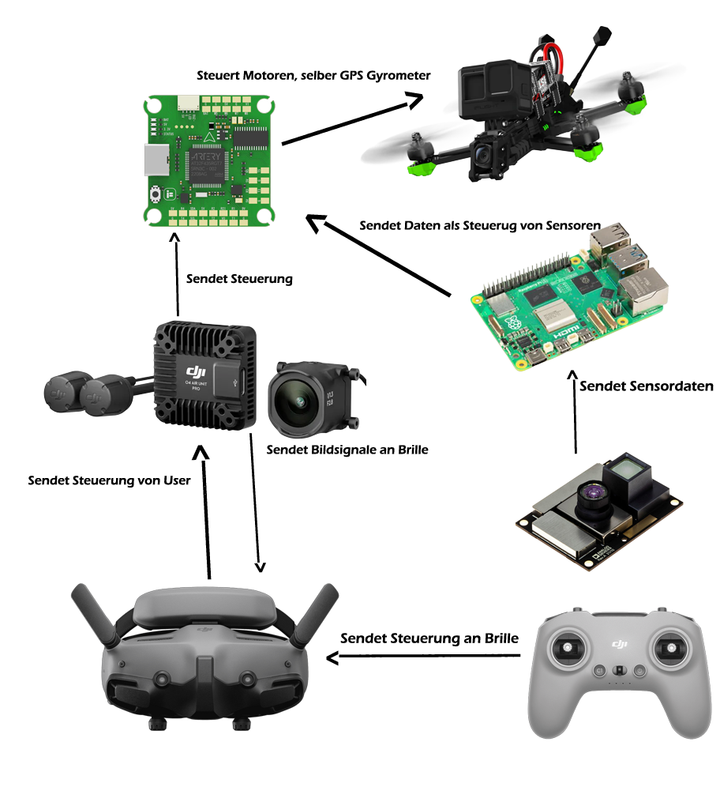

= Autonome FPV-Drohne mit Companion-Computer und Sensorintegration
:toc:
:toclevels: 2
:sectnums:

== Projektbeschreibung

Ziel des Projekts ist die Entwicklung und Umsetzung einer *teilautonomen FPV-Drohne*, die sowohl manuell mit *DJI Goggles 3* und *DJI Remote Controller 3* gesteuert werden kann, als auch durch einen *Raspberry Pi* teilautonome Flugfunktionen ausführt.

Die Basis bildet ein *BNF-FPV-Drohnenmodell* (z. B. iFlight Nazgul ECO) mit integrierter *DJI O4 Air Pro Unit* für digitale Videoübertragung.
Die Flugstabilisierung erfolgt über den vorhandenen *Flight Controller (BLITZ ATF435, Betaflight)*.
Der Raspberry Pi dient als *Companion-Computer* zur Verarbeitung zusätzlicher Sensorik und Algorithmen.

Geplante Features:

* *Crash-Safer:* Notfallprozeduren zur Stabilisierung bei Kontrollverlust
* *Position Hold:* Drohne bleibt beim Loslassen der Steuerung an der Position
* *Turtle Mode:* automatisches Aufrichten nach Crash
* *Autopilot:* GPS-, LiDAR-, Ultraschall- und Kamera-basierte Navigation (YOLO)
* *Auto-Hover / Auto-Brake*
* *Webinterface:* Konfiguration, Telemetrie, Flugpfade
* *Crash-Map:* Visualisierung von Unfällen
* *Flight Logging & Strichliste*

== Projektziele

* Aufbau und Inbetriebnahme einer FPV-Drohne mit DJI O4 Air Pro Unit
* Integration eines Raspberry Pi als Companion-Computer
* Entwicklung von Algorithmen für *Autopilot*, *Auto-Hover* und *Auto-Brake*
* Implementierung eines *Webinterfaces*
* Simulationen (Liftoff, Gazebo, Betaflight SITL)
* Praxistests

== Projektumfang / Abgrenzung

=== Umfang

* *Hardware:* FPV-Drohne, Flight Controller, O4 Air Pro Unit, Raspberry Pi, Sensoren (GPS, Ultraschall/LiDAR, Kamera)
* *Software:*
Betaflight / ArduPilot, Companion-Software (Java/Python, YOLOv5),
MAVLink/MAVSDK, Webinterface

=== Abgrenzung

* Keine Neuentwicklung eines eigenen Flight Controllers
* Fokus auf *Hybridbetrieb aus Autonomie und FPV*, nicht reines Racing

== Erwartete Ergebnisse

* Funktionsfähige hybride FPV-Drohne
* Webplattform zur Konfiguration und Flugauswertung
* Dokumentierte Simulator- und Realtests
* Nachweis der Machbarkeit teilautonomer Systeme auf Consumer-Hardware

== Aktueller Implementierungsstand

NOTE: Die obige Vision beschreibt den langfristigen Zielzustand. Der tatsächliche Stand der Implementierung weicht in Teilen ab und wird in OpenSpec (`openspec/`) fortlaufend nachgeführt.

* *iOS-Teilprojekt:* Statt eines Raspberry-Pi-Companion-Computers wird ein *ESP32* (PlatformIO) als Bridge zum Flight Controller verwendet, mit dem *MSP-Protokoll* über UART. Die Kommunikation zur iOS-App ist *hybrid*: lokal direkt per UDP auf Port 4242, remote über ein Python-Relay mit WebSocket-Tunnel (Ngrok). Die iOS-App enthält zusätzlich einen *Phone-Side Simulator* (Mode-2 Joystick, Rate-Mode-Physik) für Steuergefühl ohne reale Drohne. Quellen: `openspec/changes/sprint-03`, `openspec/changes/sprint-04`, `EasyPilotIOS/`, `PlatformIO/`.
* *Webinterface-Teilprojekt:* Separates Sub-Projekt (`webinterface/`) mit Java-Backend und React-Frontend. Wird nicht über OpenSpec geführt.

== Minutes of Meeting

* link:minutes-of-meetings/2025-11-25_Sprintplanning.html[Sprintplanning – 25.11.2025]
* link:minutes-of-meetings/2025-12-23_Sprintplanning.html[Sprintplanning – 23.12.2025]

== Visualisierung von Technologien

== Technologie-Stack

* *Backend:* Java (Quarkus)
* *Datenbank:* PostgreSQL
* *Frontend:* Angular oder React
* *Versionierung:* GitHub, GitHub Actions, Deployment auf Cloudflare
* *Drohnen-Tools:* MAVLink, YOLOv5, Betaflight

[plantuml, drone-system, png]
----
@startuml
!theme mars
skinparam componentStyle uml2

component "Frontend\n React" as FE
component "Backend\n(Quarkus)" as BE
component "PostgreSQL" as DB
component "Raspberry Pi\n(Companion Computer)" as RPI
component "Flight Controller\n(Betaflight)" as FC
component "GitHub / CI" as CI

FE --> BE : REST API
BE --> DB : Persistenz
RPI --> FC : MAVLink
CI --> FE : Deploy
CI --> BE : Deploy

@enduml
----
